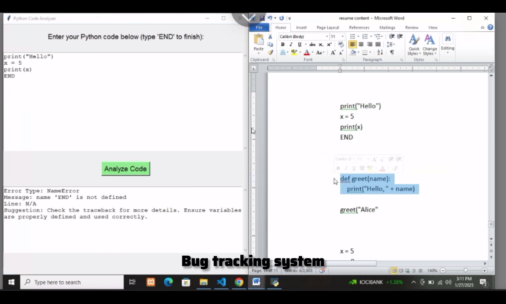

# 🐞 Bug Tracking System

The **Bug Tracking System** is a Python-based tool designed to help developers, testers, and project managers **log, track, and manage bugs** efficiently during software development. It provides a simple command-line interface for creating bug reports and reviewing bug details.

---
## 📸 Output Screenshot



---
## 📌 Overview

A bug tracking system helps teams record bug details, track bug status, and maintain a history of issues to improve software quality over time. Bug reports include information such as bug description, priority, and reporter details. Users can add and list bugs via a simple Python script. :contentReference[oaicite:0]{index=0}

---

## 🧪 How to Use / Run

1. Clone the repository
```bash
git clone https://github.com/Vikaymaker/Bug-Tracking-System.git
cd Bug-Tracking-System
```
